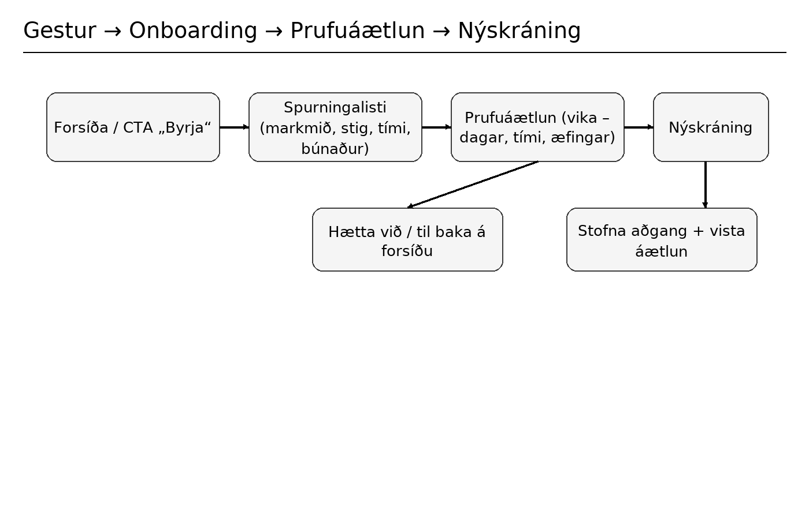
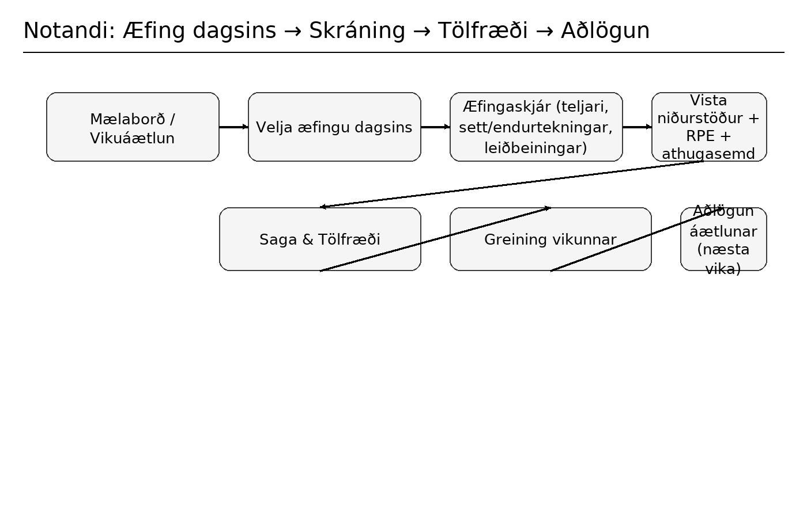
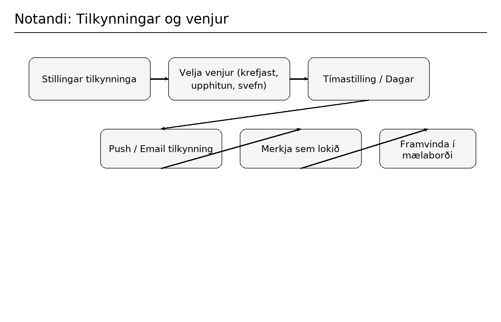
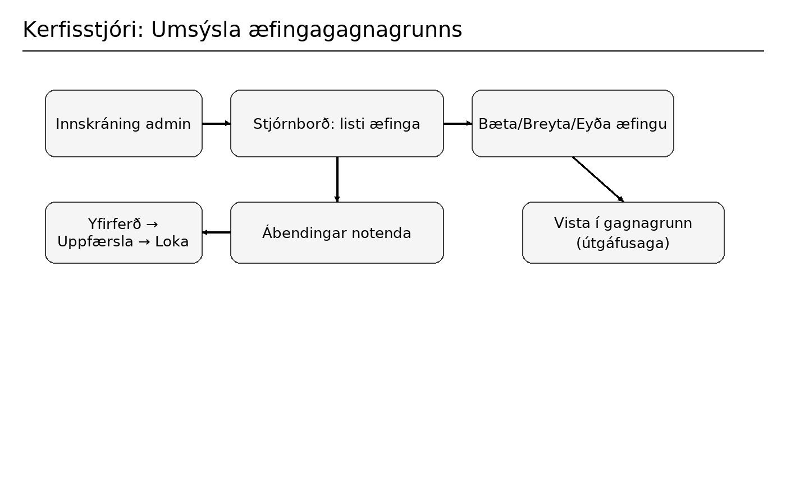

# FitFlow — líkamsræktarforrit

> **Verkefni 2 / 10% einkunnar**  
> Höfundur: Sebastian Lukasz Lis (einstaklingsverkefni)

---

## Efnisyfirlit
1. [Almenn lýsing](#almennt-lýsing)
2. [Notendur og notendasögur](#notendur-og-notendasögur)
3. [Notendasviðsmyndir](#notendasviðsmyndir)
4. [Flæðirit (Figma)](#flæðirit-figma)
5. [MVP — lágmarksstarfhæf útgáfa](#mvp--lágmarksstarfhæf-útgáfa)
6. [Kerfisarkitektúr (tillaga)](#kerfisarkitektúr-tillaga)
7. [Lágmarks gagnalíkan](#lágmarks-gagnalíkan)
8. [Framkvæmdaáætlun og matsviðmið](#framkvæmdaáætlun-og-matsviðmið)
9. [Leiðbeiningar: geymsla og skil](#leiðbeiningar-geymsla-og-skil)
10. [Leyfi](#leyfi)
11. [Höf. / samskiptaupplýsingar](#höf--samskiptaupplýsingar)

---

## Almennt lýsing

**Vandamál**  
Margir missa móðinn í æfingum og vita ekki hvernig á að setja upp raunhæfa áætlun sem passar við tíma, búnað og markmið. Hefðbundin öpp eru oft of flókin eða of almenn.

**Lausn**  
**FitFlow** er einfalt (vef-/snjallsíma) app sem:
- safnar markmiðum (t.d. „léttast um 5 kg“, „byggja styrk“, „bæta þol“),
- tekur mið af samhengi (vikulegur tími, aðgengilegur búnaður, getustig),
- býr til **vikulega æfingaáætlun** (heimili / líkamsræktarstöð),
- leiðir notanda **skref fyrir skref** í æfingu (teljari, sett/powt. teljarar, öryggisleiðbeiningar),
- skráir framvindu (RPE — _Rating of Perceived Exertion_, skynjuð áreynsla; athugasemdir) og minnir á venjur (upphitun, teygjur, skref),
- stingur upp á **aðlögunum vikulega** út frá frammistöðu og upplifun.

**Fyrir hvern**
- **Byrjendur** — vilja tilbúna, einfalda áætlun og skýrar leiðbeiningar.  
- **Uppteknir miðlungsnotendur** — stuttar, árangursríkar lotur og mæling á framvindu.  
- **Fólk að koma aftur eftir hlé** — stigvaxandi álag og öryggi.  
- **Kerfisstjóri** (tæknilegt hlutverk) — sér um æfingagrunn og efni.

**Aðalstyrkleikar**
- Onboarding → tafarlaus áætlun, einfalt viðmót, vikulegar aðlaganir, ör-venjur.

---

## Notendur og notendasögur

### Hlutverk
1. **Gestur (óskráður)** — skoðar forsíðu, fer í onboarding.  
2. **Notandi (innskráður)** — æfir, skráir niðurstöður, fylgist með framvindu, fær tilkynningar.  
3. **Kerfisstjóri** — stýrir æfingagrunninum, sér um efni og ábendingar.

### Dæmi um notendasögur (hver/hvað/af hverju) + samþykktarskilyrði (AC)

**Gestur**
- _Sem **gestur** vil ég fara í stuttan spurningalista (markmið, stig, tími, búnaður) **til þess að** fá prufu-vikuáætlun._  
  **AC**: 5–7 spurningar, forskoðun áætlunar (dagar, tími, æfingar), CTA „Stofna aðgang“.
- _Sem **gestur** vil ég sjá sýniskort og lista yfir ávinning **til þess að** meta hratt gagnsemi appsins._  
  **AC**: lendingarsíða með 3 mockup-um og ávinningahluta.

**Notandi**
- _Sem **notandi** vil ég skrá mig með tölvupósti og lykilorði **til þess að** vista áætlun og framvindu._  
  **AC**: nýskráning, innskráning, endurstilling lykilorðs, villuprófanir.
- _Sem **notandi** vil ég búa til 7 daga áætlun **til þess að** vita hvað á að æfa hvern dag._  
  **AC**: áætlun með dögum, tímalengd, möguleiki á að skipta út æfingum.
- _Sem **notandi** vil ég framkvæma æfingu með teljara og leiðbeiningum **til þess að** gera æfingar örugglega._  
  **AC**: æfingaskjár (lýsing, myndband/hreyfimynd), sett/powt. teljarar, pásu-hnappur.
- _Sem **notandi** vil ég skrá niðurstöðu og RPE **til þess að** appið stilli álagið að mér._  
  **AC**: áreynslukvarði, athugasemd, vistun í sögu.
- _Sem **notandi** vil ég sjá vikutölfræði **til þess að** fylgjast með þróun og mætingu._  
  **AC**: fjöldi æfinga, heildarálag, línurit/stafir, streak.
- _Sem **notandi** vil ég fá tilkynningar **til þess að** viðhalda reglusemi._  
  **AC**: tilkynningar í síma/tölvupóst eftir áætlun.

**Kerfisstjóri**
- _Sem **kerfisstjóri** vil ég bæta/leiðrétta/eyða æfingum **til þess að** gagnagrunnur sé uppfærður._  
  **AC**: CRUD á æfingum (heiti, lýsing, stig, búnaður, merki, miðlun).
- _Sem **kerfisstjóri** vil ég meðhöndla ábendingar frá notendum **til þess að** bæta innihald._  
  **AC**: listi ábendinga, stöður, breytingasaga.

---

## Notendasviðsmyndir

**Persóna A — Ása (23, byrjandi)**  
1) Forsíða → 2) Spurningar: „léttast“, stig „byrjandi“, 3×30 mín/viku, enginn búnaður →  
3) Forskoðun áætlunar → 4) Nýskráning → 5) Æfing „Heildarlíkami – 25 mín“ með teljara → 6) RPE=6/10 → 7) Eftir viku væg aukning.

**Persóna B — Bjarni (34, lítið svigrúm)**  
1) Markmið „þol + styrkur“, búnaður: handlóð, 4×40 mín → 2) Áætlun (2× styrkur + 2× HIIT) →  
3) Skráir lóð og endurtekningar → 4) Tölfræði: aukið álag, áminningar um teygjur.

**Persóna C — Katrín (kerfisstjóri)**  
1) Innskráning í stjórnborð → 2) Bætir við „Goblet Squat“ (myndband, merki) →  
3) Uppfærir lýsingu eftir ábendingu notanda → 4) Lokar ábendingu.

---

## Flæðirit (Figma)

**Figma-skrá (skiptu út hlekk):**  
https://www.figma.com/file/TwojLinkDoPliku

### 1) Gestur → Onboarding → Prufuáætlun → Nýskráning

### 2) Notandi: Æfing dagsins → Skráning → Tölfræði → Aðlögun

### 3) Notandi: Tilkynningar og venjur

### 4) Kerfisstjóri: Umsýsla æfingagagnagrunns

---

## MVP — lágmarksstarfhæf útgáfa
- Nýskráning/innskráning (tölvupóstur + lykilorð + endurstilling).
- Onboarding (spurningar) + 7 daga áætlunargjafi.
- Æfingaskjár: teljari, sett/powt., öryggisleiðbeiningar, skráning niðurstaðna og RPE.
- Saga + einföld vikutölfræði (æfingafjöldi, heildarálag, streak).
- Tilkynningar (staðværar tilkynningar / tölvupóstur – stubbað fyrir verkefni).

**Utan MVP (dæmi):** snjallúr-/skynjarasamþættingar, næringaráætlanir, samfélagsmöguleikar, greiðslugátt/premium.

---

## Kerfisarkitektúr (tillaga)

**Framendi**: React (vef) eða React Native (snjallsími).  
**Bakendi**: Node.js/Express eða serverless föll, REST API.  
**Gagnagrunnur**: Postgres (t.d. Supabase).  
**Miðlun**: CDN fyrir myndbönd/myndir af æfingum.

---

## Lágmarks gagnalíkan

**`exercises`**  
`id`, `name`, `level`, `equipment`, `muscle_groups`, `instructions`, `media_url`

**`plans`**  
`id`, `user_id`, `week_start`, `goals`, `context`, `days (JSON)`

**`workouts`**  
`id`, `user_id`, `plan_id`, `day`, `rpe_avg`, `notes`

**`sets`**  
`id`, `workout_id`, `exercise_id`, `reps`, `weight`, `duration`
